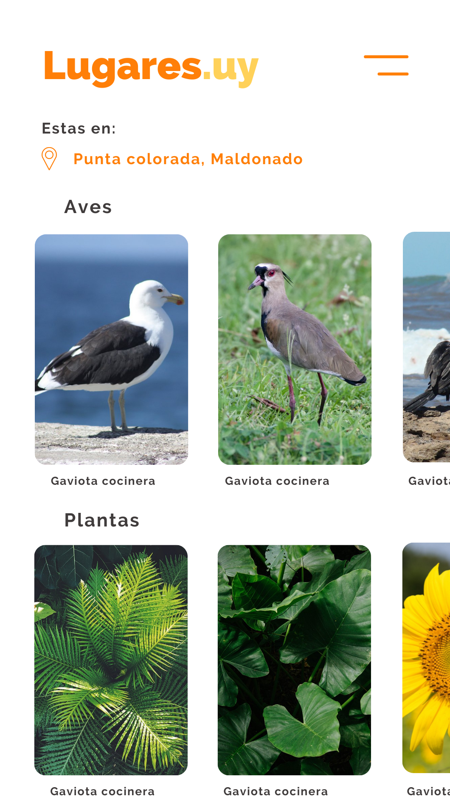

Es un proyecto sobre la creación de códigos qr para colocar en diferentes lugares de Uruguay. Al escanear este código qr veremos un grid donde se muestren los organismos más probables de ver en esa área dividios por grupos. La información para calcular probabilidades es a través de la api de [inaturalist](https://api.inaturalist.org/v1/docs/).

Esquema de la webapp:

## Log

### 6/2/2022

Probé en realizar el siguiente [request](https://api.inaturalist.org/v1/observations?iconic_taxa=Aves&nelat=-34.3153204479677&nelng=-52.344795383944074&place_id=any&quality_grade=research&subview=map&swlat=-35.553690012709126&swlng=-57.571540989412824&per_page=200") a inat donde especifiqué:

- Boundig box utilizando una lat y long determianda.
  - `nelat=-34.3153204479677`
  - `nelng=-52.344795383944074`
  - `swlat=-35.553690012709126`
  - `swlng=-57.571540989412824`
- Grupo de organismos `iconic_taxa=Aves`
- Con calidad de investigación `quality_grade=research`
- Cantidad de observaciones máxima `per_page=200`

No me convenció porque las observaciones eran pocas, y las especies que sugería no era la más probable de ver.
